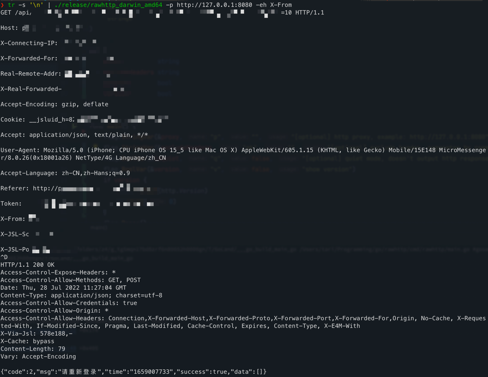

# RawHttp

输入 HTTP 原始数据包，可设置上游代理，通过原始 HTTP 数据包发送 HTTP 请求
```bash
./rawhttp 
```

进阶使用，一些场景下可能存在多余的换行之类的，可以去除掉
```bash
tr -s '\n' | ./rawhttp -p http://127.0.0.1:8080 -eh X-From
```
+ 运行以上命令，输入HTTP包
+ `-eh` 参数会匹配 HTTP 头部并移除
+ `-p` 参数指定上游代理，比如可以代理到 burp
+ 输入 `ctrl+d` 结束输入，终端输出结果，也可以在Burp抓包中看到结果

